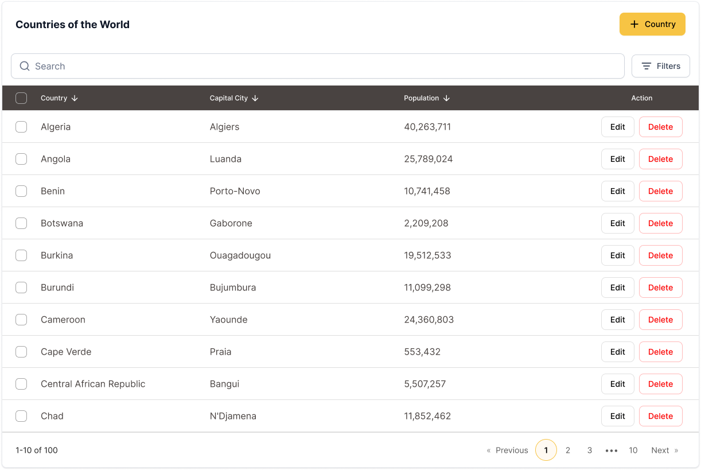
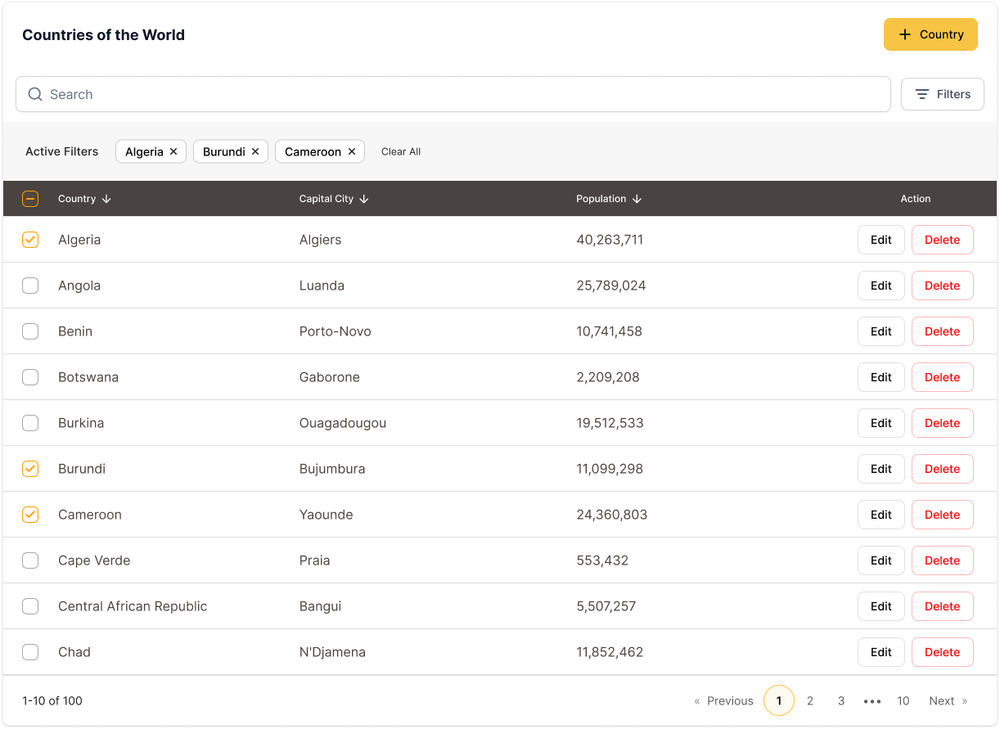

# dev-skill-test

This is an exam project for candidates.

We use **React** for the frontend and **Express** for the backend.

---

## Assignment

Create a new page to display selected country tags.




### Frontend

1. A user can search by typing in a search box and clicking the filter button.  
   **Expectation:** The countries list should be fetched via API and displayed correctly, ignoring any already selected country tags.

2. A user can select multiple countries by clicking the checkboxes.  
   **Expectation:** Each selected country should be displayed as a tag.

3. A user can remove a country by clicking the `x` button on a tag or by unchecking the corresponding checkbox.  
   **Expectation:** The tag should be removed and the checkbox should be unchecked.

4. A user can change pages in the country list.  
   **Expectation:** The new results should be shown, and the selected tags should remain.

5. A user can create a new country by clicking `+ Country`
   **Expectation:** Open a modal or a new page where the user can add a new country to the countries list. (You can design this page freely.)

6. A user can edit a country.
   **Expectation:** Open the same modal/page used for creating a new country, allowing the user to edit and update the details.

7. A user can delete a country.
   **Expectation:** Show a confirmation popup, and if confirmed, delete the country from the countries list.

   <span style="color:red">Note: Style and design are not important. Please do them last, they can give you extra points</span>.

### Backend

1. Create a migration and seed data into the database using the data from `./backend/mockup/country.json`.
2. Create APIs for inserting and querying data to serve the frontend.
3. Update this `README.md` with instructions on how to run the migration and seed data.

---

## Expectations

### Junior

1. Complete the assignment.

### Mid-Level

1. Same as Junior.
2. Convert the search box into an autocomplete with a maximum of 3 suggestions.
3. Optimize component rendering (avoid unnecessary re-renders).
4. Add CLI commands:
   - `yarn db:migration` to run the migration.
   - `yarn db:seed` to seed the data.
5. Improve the API (e.g., caching, ETag support).
6. Add validation: country names must be unique (case-insensitive).

### Senior

1. Same as Mid-Level.
2. Add unit tests for the API.
3. Add unit tests for debounce functionality and searching.
4. Create a Docker setup for the frontend:
   - Use the correct Node.js version.
   - Auto-run `yarn` (install dependencies).
   - Hot-reload should still work normally.
5. Update Docker to auto-run migration and seeding when executing `./docker.sh`.

---

## How to Run the Project

### Frontend

```bash
cd ./frontend
```

#### Start the project
1) Install dependencies:
```bash
yarn
``` 

2) Run the project
```bash
yarn dev
```

### Backend
```bash
cd ./backend
```

#### What's Included
1) prisma
2) postgres db
3) mockfile (mockup/country.json)

#### Start the Project
1) Rename `.env.example` to `.env`
1) Run your local `docker desktop`
1) Run docker:
```bash
cd backend
chmod +x ./docker.sh
./docker.sh
```
1) Start the backend:
```bash
yarn dev
```